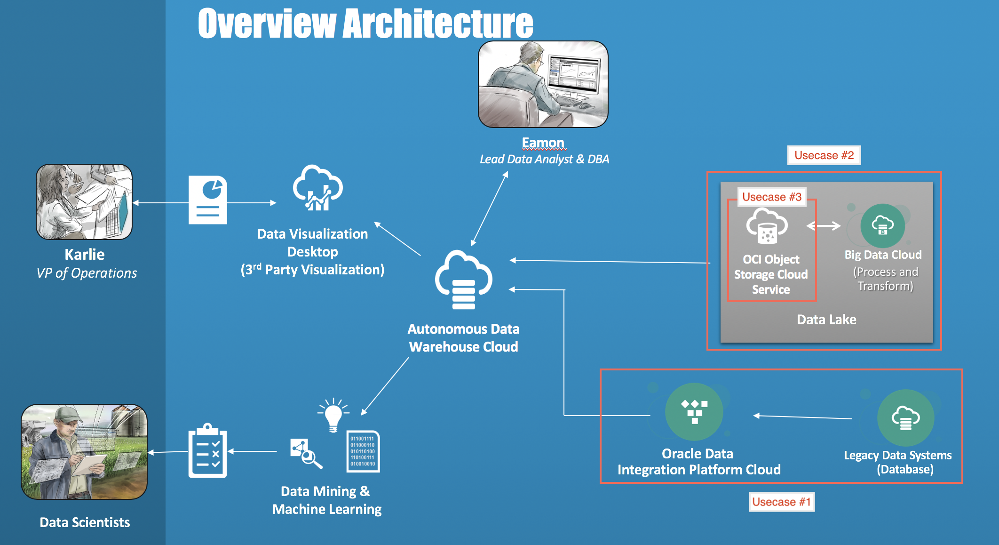

# ADWC DEMO
Aug 22, 2018

Author: Sravya Ganugapati
## Index
1. [Introduction](#introduction)
2. [Usecases Overview](#usecases-overview)
1. [Oracle Cloud Services Used](#Oracle-cloud-services-used )
    1. [Oracle Autonomous Data Warehouse Cloud Service](#oracle-autonomous-data-warehouse-cloud-service)
    1. [Oracle Database Cloud Service](#Oracle-Database-Cloud-Service)
    1. [Oracle Data Integration Platform Cloud](#Oracle-Data-Integration-Platform-Cloud)
    1. [Oracle Big Data Cloud](#Oracle-Big-Data-Cloud)
    1. [Oracle Cloud Infrastructure](#Oracle-Cloud-Infrastructure)
    1. [Oracle Analytics Cloud](#Oracle-Analytics-Cloud)
3. [Uscase #1](#usecase-#1)
4. [Uscase #2](#usecase-#2)
5. [Uscase #3](#usecase-#3)
6. [Uscase #4](#usecase-#4)
7. [Conclusion](#conclusion)
8. [dkhjf](#Oracle-Autonomous-Data-Warehouse-Cloud-Service)

## Introduction
This demo will walk you through the different usecases that achieve data integration of different data sources, especially big data and relational data in one place - Oracle Autonomous Data Warehouse Cloud - using Oracle cloud products and services. To try Oracle Cloud services, please visit [Oracle Cloud](http://cloud.oracle.com) and sign up for a free trial account worth $300. 

Oracle Autonomous Data Warehouse Cloud provides an easy-to-use, fully autonomous database that scales elastically, delivers fast query performance and requires no database administration.
* **Scalable**: so you can scale down the environments when the resources are not needed, significantly reducing costs or even totally disable the CPU when not in use and just keep the storage up and running.
* **Fast**: delivers high performance data warehousing straight out-of-the-box with unparalleled scalability and reliability. Built on key Oracle Database capabilities: parallelism, columnar processing and compression. All aspects of performance tuning are automatically managed so the service requires no database tuning.
* **Self-driving**: virtually eliminates the need for the manual operational tasks such as backup and patching 
which provides consistently better performing and more secure environments.
* **Automation**: opens opportunities for DBAs to elevate their roles from custodians of databases into more valued data professionals who can deliver more  applications, focus more on the needs of application developers, and extract more value from their current data assets.

## Oracle Cloud Services Used
* [Oracle Autonomous Data Warehouse Cloud Service](https://cloud.oracle.com/en_US/datawarehouse)
* [Oracle Database Cloud Service](https://cloud.oracle.com/database)
* [Oracle Data Integration Platform Cloud](https://cloud.oracle.com/en_US/data-integration-platform)
* [Oracle Big Data Cloud](https://cloud.oracle.com/bigdata)
* [Oracle Cloud Infrastructure Object Storage](https://cloud.oracle.com/storage/object-storage/features)
* [Oracle Analytics Cloud](https://cloud.oracle.com/en_US/oac)

## Usecases Overview
The goal of these usecases is to consolidate different kinds of data - relational and big data, in this demo - in one place such as [Oracle Autonomous Data Warehouse Cloud](https://cloud.oracle.com/en_US/datawarehouse). Here is the overall architecture of this demo.

Once we have the relational data and the big data in Oracle Autonomous Data Warehouse, we can connect it to Oracle Data Visualization Desktop for preparing reports and visualizations or we can perform data mining and machine learning in the Zeppelin notebooks that come out-of-the-box with Oracle Autonomous Data Warehouse Cloud service. The reports are shareable across the organization and a Data Analyst can run analysis similar to how he or she does on a regular database.

1. ### Usecase #1: Relational data to Oracle Autonomous Data Warehouse Cloud using Oracle Data Integration Platform Cloud

    This usecase explains how we can achieve loading data from a relational database, that could represent on-premise legacy data sources for an organization, into an Oracle Autonomous Data Warehouse Cloud instance. This is implemented using Oracle Data Integrator that is part of Oracle Data Integration Platform Cloud.

2. ### Usecase #2: Big data to Oracle Autonomous Data Warehouse Cloud using Oracle Data Lake (Oracle Big Data Cloud + Oracle Cloud Infrastructure Object Storage)

    This usecase shows how we can leverage Oracle Data Lake to run Big Data workloads and push it to Oracle Autonomous Data Warehouse Cloud after data processing.

3. ### Usecase #3: External Table

    In this usecase, we create an external table in Oracle Autonomous Data Warehouse Cloud from Oracle Cloud Infrastructure Object Storage. The data is not brought into Oracle Autonomous Data Warehouse Cloud, but resides in Oracle Cloud Infrastructure Object Storage and on which we can run queries efficiently.

4. ### Usecase #4: Visualization using Oracle Analytics Cloud

    In this last usecase, we show how we can connect Oracle Data Visualization Desktop, which is part of Oracle Analytics Cloud and Oracle Autonomous Data Warehouse Cloud to make visualizations on the consolidated data and to obtain better data inisghts.

## Oracle Cloud Services Overview

In this section, we go through the features and the provisioning details of the Oracle Cloud services used through out this demo.

1. ### Oracle Autonomous Data Warehouse Cloud Service
    #### Provisioning
    * The Oracle Autonomous Data Warehouse is provisioned in a very easy and a quick way - you just need a couple of details suchas how much storage and CPU you need and an admin password. The provisioning takes around 30 seconds to 1 minute and you are ready to use your instance!

    * Here are the steps to follow for provisioning an Oracle Autonomous Data Warehouse Cloud Service instance.

        1. Click on Autonomous Data Warehouse Cloud from the OCI Cloud Console.

            

        1. Click on Create Autonomous Data Warehouse.
            

        1. Provide details for creating Autonomous Data Warehouse Cloud instance.
            

    #### Oracle Autonomous Data Warehouse Cloud Console
    * The Autonomous Data Warehouse Cloud Console provides a dashboard that shows the storage capacity of the warehouse, CPU utilization, running SQL executions etc.
    

    #### Connecting to Oracle Autonomous Data Warehouse Cloud
    * Autonomous Data Warehouse Cloud service provides a secure way of connecting to it with the help of a Credential Wallet which the connecting client can use.
    * The client can download the wallet from the ADWC instance’s console.
    
    * Use ADWC provisioning password and the downloaded Credential Wallet zip file to create a connection to the Autonomous Data Warehouse Cloud instance.
    
    

1. ### Oracle Database Cloud Service

1. ### Oracle Data Integration Platform Cloud

1. ### Oracle Big Data Cloud

1. ### Oracle Cloud Infrastructure

1. ### Oracle Analytics Cloud

## Usecase #1
## Usecase #2
## Usecase #3
## Usecase #4
## Conclusion